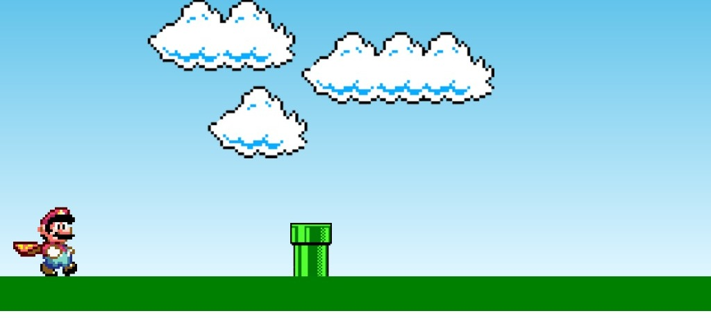

# jogoMario

## Descrição
Jogo do Mario utilizando HTML, CSS e Javascript cujo o objetivo é o Mario saltar por cima dos tubos.



## Objetivo
Colocar em prática os conceitos de Git e GitHub — criação e configuração de repositório, organização de arquivos, uso de branches, commits e merge — seguindo uma estrutura próxima à utilizada em projetos reais de desenvolvimento de software.

## Tecnologias
- HTML
- CSS
- JavaScript

## Instalação
Não há dependências para instalar — o projeto é feito em HTML, CSS e JavaScript puros.
```bash
cd frontend
```

## Execução
Basta abrir o arquivo `index.html` no navegador (duplo clique ou "Abrir com" o navegador de sua preferência).

## Integrantes

| Nome          | Matricula | Papel         |
|---------------|-----------|---------------|
| Guilherme Nunes | 01840418   | Scrum Master  |
| Emanuel Lima  | 01719420    | Documentador  |
| Gabriel Luann| 01654299    | Testador |
| Jose Diego| 01827097    | Desenvolvedor / Documentador |
| Heitor correia| 01841124    | Desenvolvedor |
| Cauan Andrade| 01821096    | Testador |
